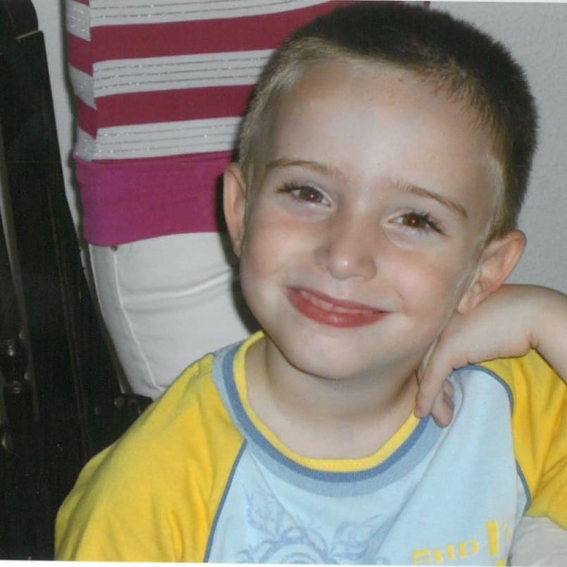
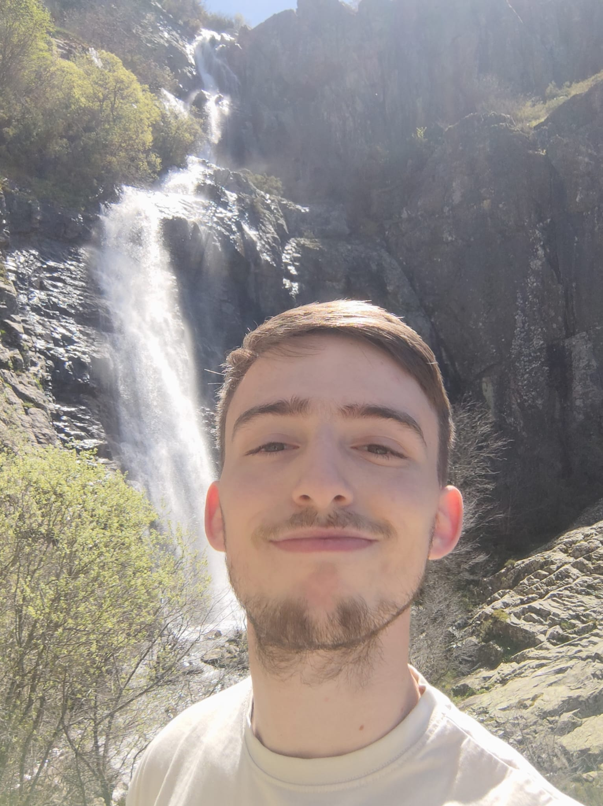
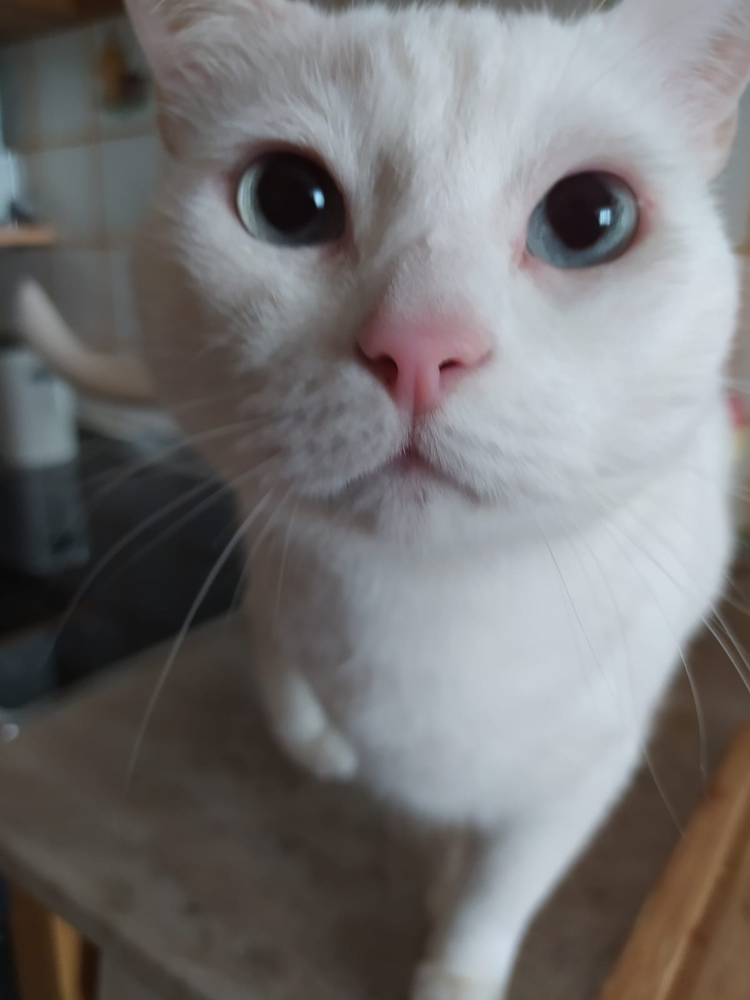

<!-- Main -->

<!-- One -->
<section id="one">
	

		<header class="major">
			<h2>Introduction</h2>
		</header>
		
Hi! I’m Francisco Miguel, a passionate game developer driven by a love for video games since I was a child.Been involved in the videogames industry has always been my goal for years and to achieve that goal I had to leave my hometown Barbate, which is a small city in the south of Spain, in order to studying in Universidad Complutense de Madrid

	

</section>

<section id="two" class="spotlights">
	<section>
		
		

			

				<header class="major">
					<h3>First Steps in Gaming</h3>
				</header>
				
The first time I knew about what videogames were like was when I was 4 years old and my older cousin lend me his NintendoDS with Pokemon Diamond on. I can't describe what I felt but I still can remember that it meant it all to me, my parents so how bad I wanted to play with my cousin's Nintendo and they decided to buy me one.

			

		

	</section>
	<section>
		
		

			

				<header class="major">
					<h3>Turning Point</h3>
				</header>
				
When I was in high school my grandfather passed away and at that time I didn't know how to handle it and videogames helped me escape reality while I was playing. That's where I discovered the game that changed it all, Firewatch. This game made me feel a lot of things but above all I felt identified with the main character, the way he tries to avoid his reality by having a job as a forest guard and the way the game ends helped me through my journey. 
				At the time I ended I decided that I wanted to be like those people that made that game and that I wanted to help people from all around the world with my work and passion and my goal since then is still the same. 

			

		

	</section>
	<section>
		
		

			

				<header class="major">
					<h3>Leaving home</h3>
				</header>
				
At the time I finished high school I already knew where I wanted to study, in Universidad Complutense de Madrid, and with the constant support of my parents I had the possibility of goind to the capital in order to follow my dreams. 
				Here I've meet a lot of new friends and certain people that have truly changed my life like my girlfriend Patricia which has helped me a lot in my university time and has helped me make other dreams come true like going to watch some League of Legends e-sports abroad.

			

		

	</section>
	<section>
		
		

			

				<header class="major">
					<h3>Right Now</h3>
				</header>
				
At the moment, while I'm finishing my bachellor I'm already looking for a place for me in the industry to get started. In working terms I describe myself as a hard worker, collaborative, I like to hear others opinions and see what people can bring to the projects and above all I'm passionate of what I do every single day :)  
				I couldn't end this part of my portfolio without a picture of my cat, her name is Blanca. 

			

		

	</section>
</section> 

