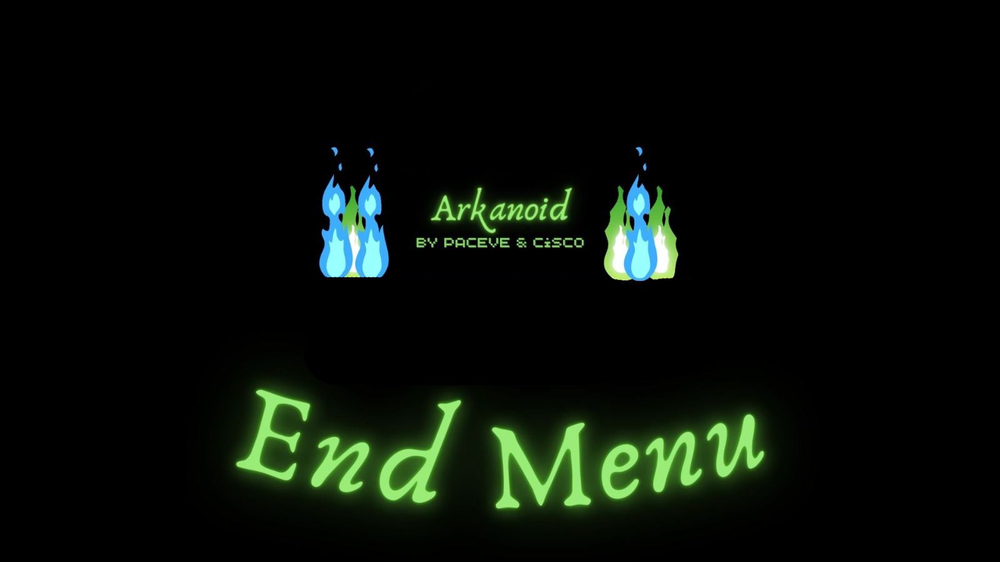
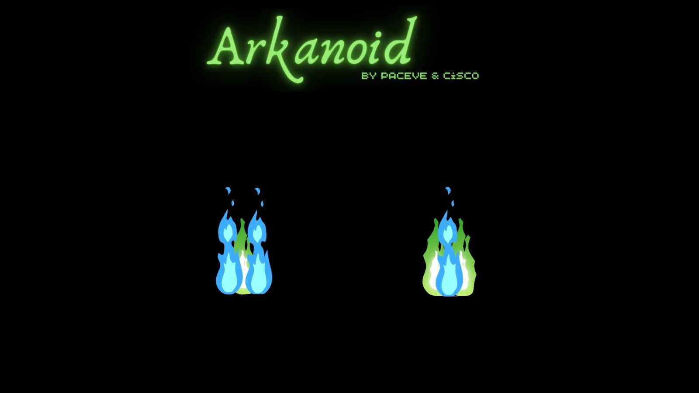
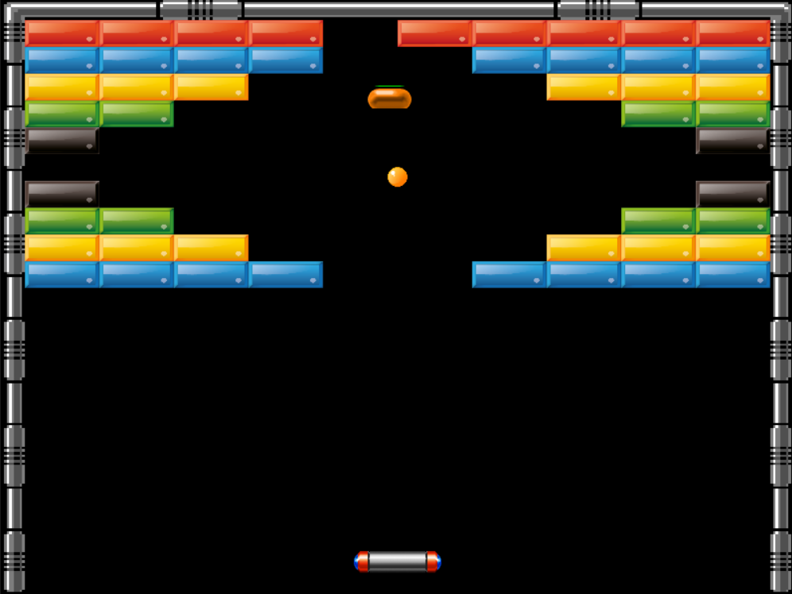
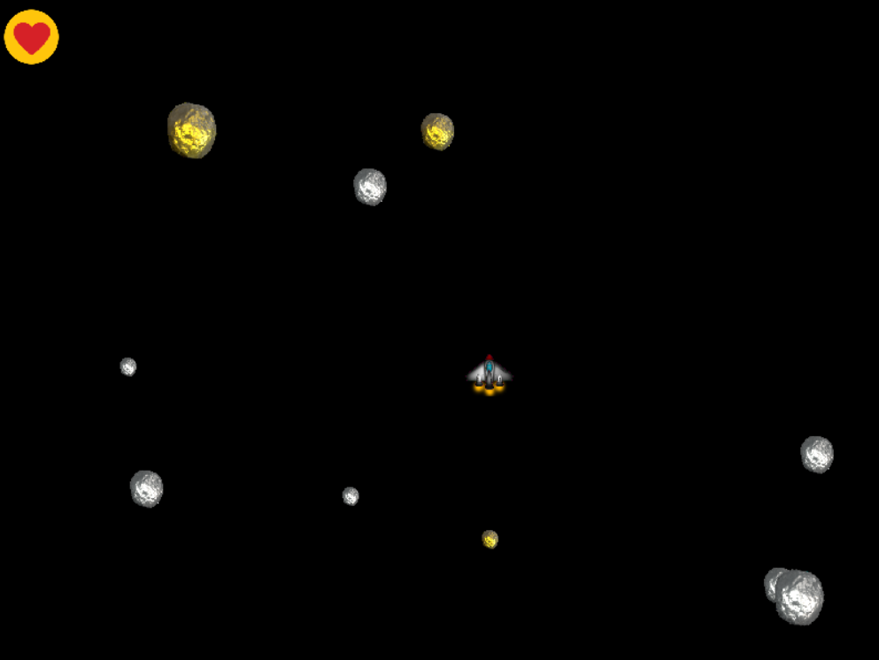
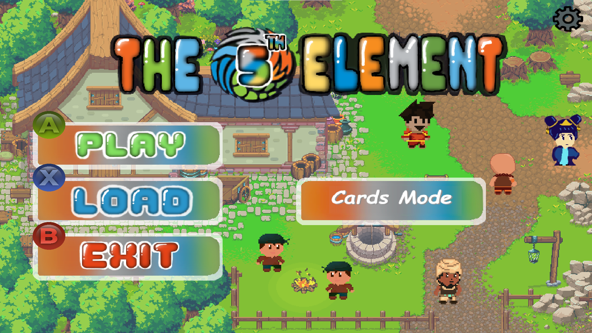
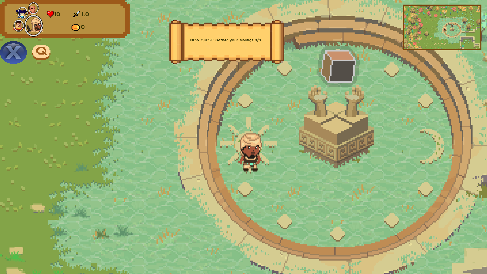
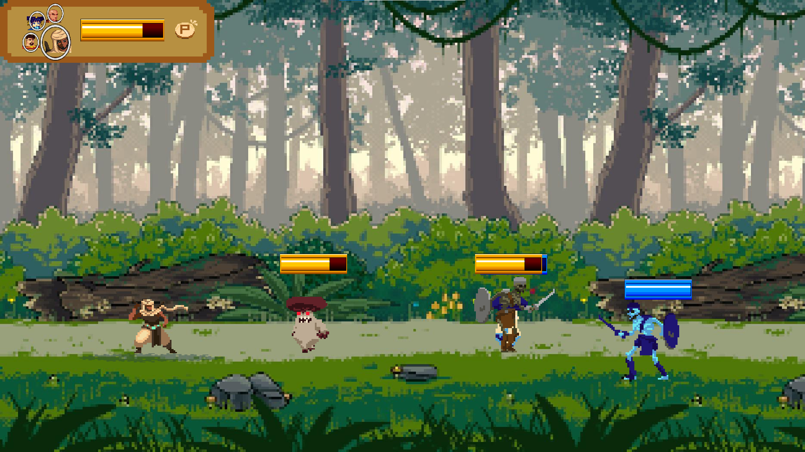
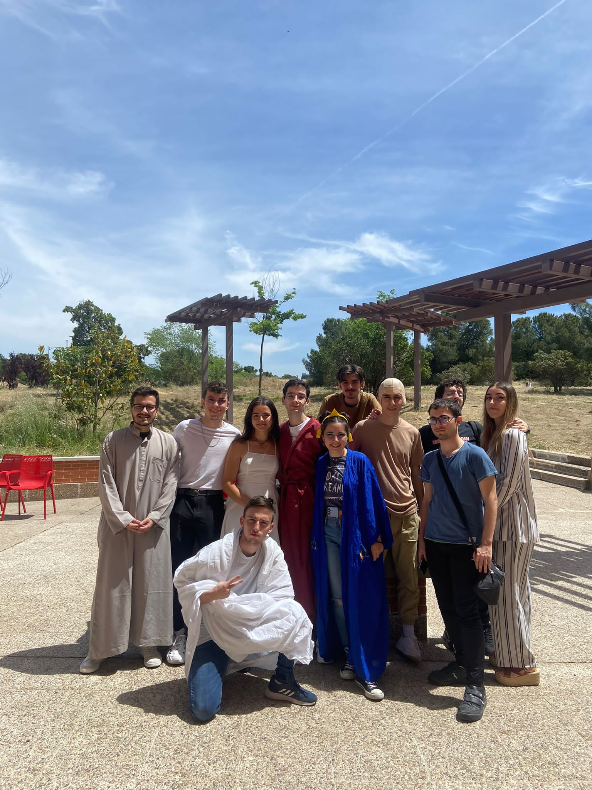
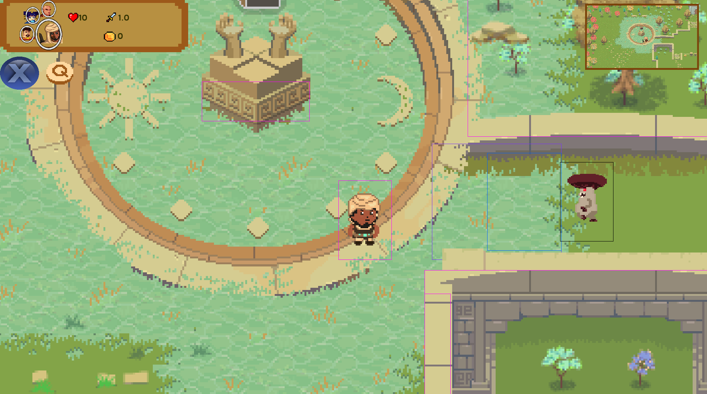

<!-- Main -->

<!-- One -->
<section id="one">
	

	

		<header class="major">
			<h1>Arkanoid</h1>
		</header>
	

<!-- Elements -->

	

<blockquote>In this project we had to replicate the old game using only SDL. SDL gave us the posibility to render images and to had input and with those two aspects we had to program everything else like collisions or the creation of the block map from a data file structure. One of the most complexes things was to be very careful with when we could erase objects when we changed from one state to another across our GameStateMachine. Another complex thing was to program de bounce of the ball, because it dependeds of things such as its direction, the paddle direction, the place where the collision takes place...</blockquote>

<ul class="actions">
                <li><a href="https://github.com/PabloCerrada/Arkanoid" class="button">Project Repository</a></li>
            </ul>

	<!-- Break -->
	

		
<h3>Main Menu</h3>

		 
	

	

			
<h3>Game Scene</h3>

		
	

	

			
<h3>End Menu</h3>

		
	

<!-- Main -->

<!-- One -->
<section id="one">
	

	

		<header class="major">
			<h3>Features</h3>
		</header>
	

<!-- Elements -->

	

		<ul>
		    <li>The base game has 3 levels, you will go through them by destroying every block or getting the L powerup</li>
			<li>GameStateMachine with a stack of states that is the one that updates the state on top of that stack. It also has methods to change from one state to another.</li>
			<li>We have several rewards. They are movebable objects that change your paddle's state when hit. Their peculiarity is their way of rendering their animation, to do so, we have to iterate in its own column between every frame in the spritesheet.</li>
			<li>The players have the possibility of building their own level, as their are red from .data files in the maps directory</li>
			<li>Herency based architecture, every object is a child of GameObject which declares the most important methods. Under GameObject, we have even more abstract classes to diference their functions more effectively.</li>
		</ul>
	

<video width="640" height="360" controls>
    <source src="forty-jekyll-theme/assets/images/Gameplay Arkanoid.mp4" type="video/mp4">
</video>

<!-- One -->
<section id="one">
	

	

		<header class="major">
			<h1>Asteroids</h1>
		</header>
	

<!-- Elements -->

	

<blockquote>As the previous project, SDL was our main library here. This time we replicated Asteroids, the classic arcade game.To win, you have to destroy every single asteroid shooting them, if you get hit three times lives, you will loose. There are two types of asteroids, the golden ones and the common ones. While the common ones follow a constant direction, the golden ones follow the player. This time we used a system based arquitecture where the logic of the game lies in these systems. One of these systems is the one in charge of gestionate the online mode, where if you share your IP with another device in the same network, you'll be able to play in a PvP mode with the other player.</blockquote>

<ul class="actions">
                <li><a href="https://github.com/PabloCerrada/Asteroids" class="button">Project Repository</a></li>
            </ul>

<!-- Main -->

<!-- One -->
<section id="one">
	

	

		<header class="major">
			<h3>Features</h3>
		</header>
	

<!-- Elements -->

	

		<ul>
		    <li>In the game you will appear with 3 lives and you have to destroy every single asteroid.</li>
			<li>GameStateMachine with a stack of states that is the one that updates the state on top of that stack. It also has methods to change from one state to another.</li>
			<li>Every GameObject is included in a system that update their states and have their logic, like the Asteroids System or the FighterSystem</li>
			<li>Component based architecture, the only difference between the fighter and the asteroids are the components they have. This way we can re-use and avoid writing more code than necessary. A component based architecture is useful to isolate functionalities.</li>
			</ul>
	

<video width="640" height="360" controls>
    <source src="forty-jekyll-theme/assets/images/Gameplay Asteroids.mp4" type="video/mp4">
</video>

<!-- One -->
<section id="one">
	

	

		<header class="major">
			<h1>The Fifth Element</h1>
		</header>
	

<!-- Elements -->

	

<blockquote>While the other games were projects without possibility of designing whatever we wanted, in The Fifth Element we had creative freedom. 
The Fifth Element is a project that came from an idea I had of making a beat em up game with a Pokemon based exploration system. So we combined both ideas and the game was born.  The game starts when you receive a letter from one of your sibling telling you that he has died and you have to reunite your other four siblings in other to accomplish his last wish, seen you all together again.   After the letter you will have to confront a lot of enemies from different kinds of elements in order to explore the 5 kingdoms, in each kingdom you will encounter one of your siblings that will take part of your team.   In each fight you will be able to switch between sibling whenever you want to take advantage of the enemies week points. </blockquote>

	

			
<h3>Top Down Mode</h3>

		
	

	

			
<h3>Beat Em Up Mode</h3>

		
	

<section id="one">
	

	

		<header class="major">
			<h2>My Experience</h2>
		</header>
	

 <section id="two" class="spotlights">
        <section>
            
            

                

                    <header class="major">
                        <h3>Group Management</h3>
                    </header>
                    
In this project we had to work in big groups (our group was eleven people), so the group management was very important in order to work efficiently. To be updated of the group work, we did weekly meetings every Sunday. In those meetings I was the one coordinating it and at the end of the meetings I put our weekly goals for every team member (I did that work in every field excepting the arts field).  When we were working presentially, I tried to help everyone I could and I tried to make a relaxed ambient, because when stress makes it out, it is not that easy to work in groups. At the end I was very proud we could end our project and having learnt everything I did was very pleasant for me

                

            

        </section>
		<section>
            
            

                

                    <header class="major">
                        <h3>Project Arquitecture</h3>
                    </header>
                    
This project was entirely made in SDL. At first we wanted to have a generical class Entity and every single object inheriting from it, but when we saw that the project size was scaling to levels we never knew we changed to a component architecture.  In terms of game states we had a GameStateMachine which was a Singleton and took care of work properly with the states, and when the state was erased, it had to destroy every single element of it to avoid having trash.

                

            

        </section>
        <section>
            
            

                

                    <header class="major">
                        <h3>My Apportation</h3>
                    </header>
                    
At the begining of the project I was in charge of setting up the SDL project along with other members of the group and I desinged what we wanted the game to look like. I created the first enemies in the TopDownMode and made their entire AI. The way they detect the player is by collision boxes. In the picture in the left, we can see how there are two boxes in front of the enemy, the bigger one warn the player that he's been seen by the enemy and the one inside it, if the player collides a fight starts.

                

            

        </section>
		<section>
            
            

                

                    <header class="major">
                        <h3>My Apportation</h3>
                    </header>
                    
I made the entire combat system, based in collision boxes too. The player can make combos hitting the attack button up to three times and can make special attacks too if it is not in delay time. Making it was really hard because every entity have different attack timings, positions, and sizes so the attack boxes spawned must be unique to each character  When the project was almost done, I noticed that when we closed it, a lot of trash was detected so I had to look script by script in order to delete every single object when the game closed. Even though this kind of work are not that visible, they are so important because it affects efficiency.

                

            

        </section>
    </section>

<header class="major">
    <h3>Attack Boxes</h3>
</header>

	<video width="640" height="360" controls>
  		<source src="forty-jekyll-theme/assets/images/CombatBoxes.mp4" type="video/mp4">
	</video>

	<section id="two" class="spotlights"> 
	 <section>
            
            

                

                    <header class="major">
                        <h3>Conclusions</h3>
                    </header>
                    
This project was the one that pushed me more to my limits in terms of being under pressure and it teached me to deal with it. I learnt that in these kind of projects I have to step up and prove myself that I can do it and I have to be proactive, if not everything won't work well. It was really pleasant seeing our project turn to what we had in mind after everything and I had really good memories while developing it.

                

            

        </section>
		 <section>
            <ul class="actions">
                <li><a href="https://ucm-fdi-disia.github.io/Selery-Studios/" class="button">Project Website</a></li>
            </ul> 
            <ul class="actions">
                <li><a href="https://github.com/UCM-FDI-DISIA/Selery-Studios" class="button">Project Repository</a></li>
            </ul> 
        </section>
    </section>

