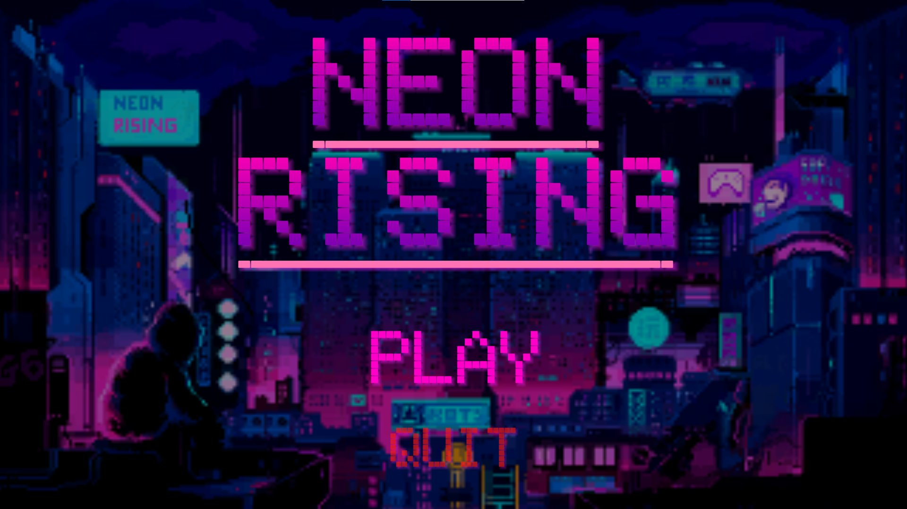

<!-- Main -->

<!-- One -->
<section id="one">
	

		<header class="major">
			<h2>Sed amet aliquam</h2>
		</header>
		
Nullam et orci eu lorem consequat tincidunt vivamus et sagittis magna sed nunc rhoncus condimentum sem. In efficitur ligula tate urna. Maecenas massa vel lacinia pellentesque lorem ipsum dolor. Nullam et orci eu lorem consequat tincidunt. Vivamus et sagittis libero. Nullam et orci eu lorem consequat tincidunt vivamus et sagittis magna sed nunc rhoncus condimentum sem. In efficitur ligula tate urna.

	

</section>

<section id="two" class="spotlights">
	<section>
		
		

			

				<header class="major">
					<h3>Orci maecenas</h3>
				</header>
				
Nullam et orci eu lorem consequat tincidunt vivamus et sagittis magna sed nunc rhoncus condimentum sem. In efficitur ligula tate urna. Maecenas massa sed magna lacinia magna pellentesque lorem ipsum dolor. Nullam et orci eu lorem consequat tincidunt. Vivamus et sagittis tempus.

				<ul class="actions">
					<li><a href="generic.html" class="button">Learn more</a></li>
				</ul>
			

		

	</section>
	<section>
		
		

			

				<header class="major">
					<h3>Rhoncus magna</h3>
				</header>
				
Nullam et orci eu lorem consequat tincidunt vivamus et sagittis magna sed nunc rhoncus condimentum sem. In efficitur ligula tate urna. Maecenas massa sed magna lacinia magna pellentesque lorem ipsum dolor. Nullam et orci eu lorem consequat tincidunt. Vivamus et sagittis tempus.

				<ul class="actions">
					<li><a href="generic.html" class="button">Learn more</a></li>
				</ul>
			

		

	</section>
	<section>
		
		

			

				<header class="major">
					<h3>Sed nunc ligula</h3>
				</header>
				
Nullam et orci eu lorem consequat tincidunt vivamus et sagittis magna sed nunc rhoncus condimentum sem. In efficitur ligula tate urna. Maecenas massa sed magna lacinia magna pellentesque lorem ipsum dolor. Nullam et orci eu lorem consequat tincidunt. Vivamus et sagittis tempus.

				<ul class="actions">
					<li><a href="generic.html" class="button">Learn more</a></li>
				</ul>
			

		

	</section>
</section>

<!-- In this page I will be presenting my Unity projects at the time. 

Since Unity is the first game engine I´ve used in my career some of these titles are very special to me because they were my first steps in our industry :)

# Neon Rising
Donec eget ex magna. Interdum et malesuada fames ac ante ipsum primis in faucibus. Pellentesque venenatis dolor imperdiet dolor mattis sagittis. Praesent rutrum sem diam, vitae egestas enim auctor sit amet. Pellentesque leo mauris, consectetur id ipsum sit amet, fergiat. Pellentesque in mi eu massa lacinia malesuada et a elit. Donec urna ex, lacinia in purus ac, pretium pulvinar mauris. Curabitur sapien risus, commodo eget turpis at, elementum convallis elit. Pellentesque enim turpis, hendrerit.

Lorem ipsum dolor sit amet, consectetur adipiscing elit. Duis dapibus rutrum facilisis. Class aptent taciti sociosqu ad litora torquent per conubia nostra, per inceptos himenaeos. Etiam tristique libero eu nibh porttitor fermentum. Nullam venenatis erat id vehicula viverra. Nunc ultrices eros ut ultricies condimentum. Mauris risus lacus, blandit sit amet venenatis non, bibendum vitae dolor. Nunc lorem mauris, fringilla in aliquam at, euismod in lectus. Pellentesque habitant morbi tristique senectus et netus et malesuada fames ac turpis egestas. In non lorem sit amet elit placerat maximus. Pellentesque aliquam maximus risus, vel sed vehicula.

Interdum et malesuada fames ac ante ipsum primis in faucibus. Pellentesque venenatis dolor imperdiet dolor mattis sagittis. Praesent rutrum sem diam, vitae egestas enim auctor sit amet. Pellentesque leo mauris, consectetur id ipsum sit amet, fersapien risus, commodo eget turpis at, elementum convallis elit. Pellentesque enim turpis, hendrerit tristique lorem ipsum dolor. -->
