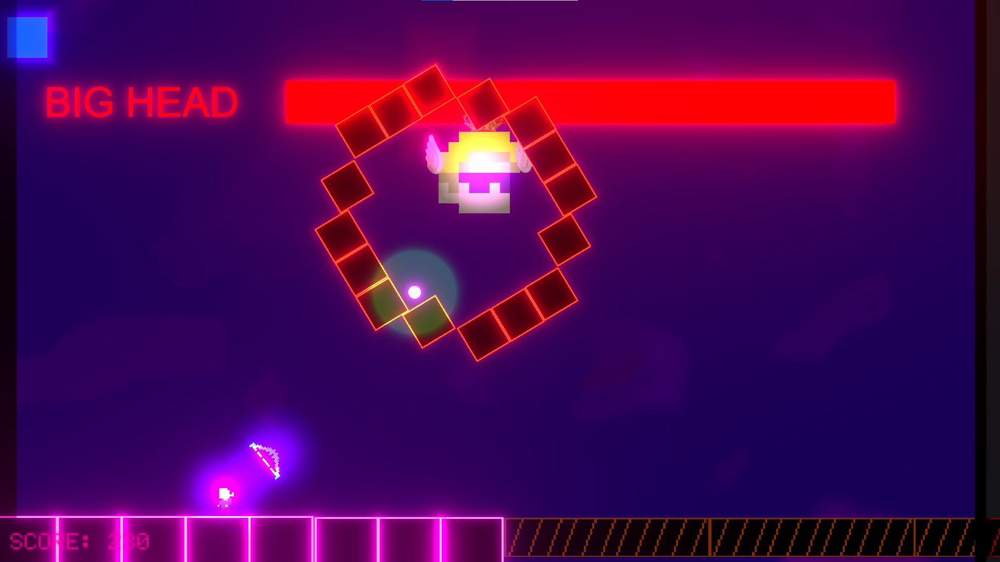

<!-- NeonRising -->

    <!-- One -->
    <section id="one">
        

            

                
Now, I'll be showing you some of my Unity projects. Since Unity was the first game engine I learned how to use, these were my first projects and they mean a lot to me :)

            

        
 
    </section>
    <section id= "one">
                 

                    <header class="major" data-position="center center">
                        <h2>Neon Rising</h2>
                    </header>
                 

    </section>      
    <section id="two" class="spotlights">
        <section>
            
            

                

                    
Neon Rising was my first project as a game developer. It is a vertical platform game where you have to use your bow to kill enemies and to teleport where the arrow hits on your way to climb way up high until reaching the one that killed your father in your childhood. 

                

            

        </section>
        <section>
            
            

                

                    <header class="major">
                        <h3>My Apportation</h3>
                    </header>
                    
In this project I was the one that had the first ideas of what we could do so then I worked in the design of both mechanics and dynamics of the game. I programmed the enemies behaviour, most of the GameManager and I was in charge of doing the test plan (it was mandatory) which turned out to be our tutorial

                

            

        </section>
        <section>
            <ul class="actions">
                <li><a href="https://sjulvez.wixsite.com/-neonrising" class="button">Project Website</a></li>
            </ul> 
            <ul class="actions">
                <li><a href="https://github.com/Proyectos1-FDI-UCM/c2022-Grupo06" class="button">Project Repository</a></li>
            </ul> 
        </section>
    </section>

    <!-- Two -->
    <section id="two">
        

            

            <header class="major" data-position="center center">
                <h3>Trailer</h3>
            </header>
            

            

                <video width="640" height="360" controls>
                    <source src="forty-jekyll-theme/assets/images/TrailerNeonRising.mp4" type="video/mp4">
                </video>
            

        

    </section>

<!-- Amon-Ra -->

    <!-- One -->
    <section id= "one">
                 

                    <header class="major" data-position="center center">
                        <h2>Amon-Ra</h2>
                    </header>
                 

    </section>      
    <section id="two" class="spotlights">
        <section>
            
            

                

                    
Neon Rising was my first project as a game developer. It is a vertical platform game where you have to use your bow to kill enemies and to teleport where the arrow hits on your way to climb way up high until reaching the one that killed your father in your childhood. 

                

            

        </section>
        <section>
            
            

                

                    <header class="major">
                        <h3>My Apportation</h3>
                    </header>
                    
In this project I was the one that had the first ideas of what we could do so then I worked in the design of both mechanics and dynamics of the game. I programmed the enemies behaviour, most of the GameManager and I was in charge of doing the test plan (it was mandatory) which turned out to be our tutorial

                

            

        </section>
        <section>
            <ul class="actions">
                <li><a href="https://sjulvez.wixsite.com/-neonrising" class="button">Project Website</a></li>
            </ul> 
            <ul class="actions">
                <li><a href="https://github.com/Proyectos1-FDI-UCM/c2022-Grupo06" class="button">Project Repository</a></li>
            </ul> 
        </section>
    </section>

    <!-- Two -->
    <section id="two">
        

            

            <header class="major" data-position="center center">
                <h3>Trailer</h3>
            </header>
            

            

                <video width="640" height="360" controls>
                    <source src="forty-jekyll-theme/assets/images/TrailerNeonRising.mp4" type="video/mp4">
                </video>
            

        

    </section>

