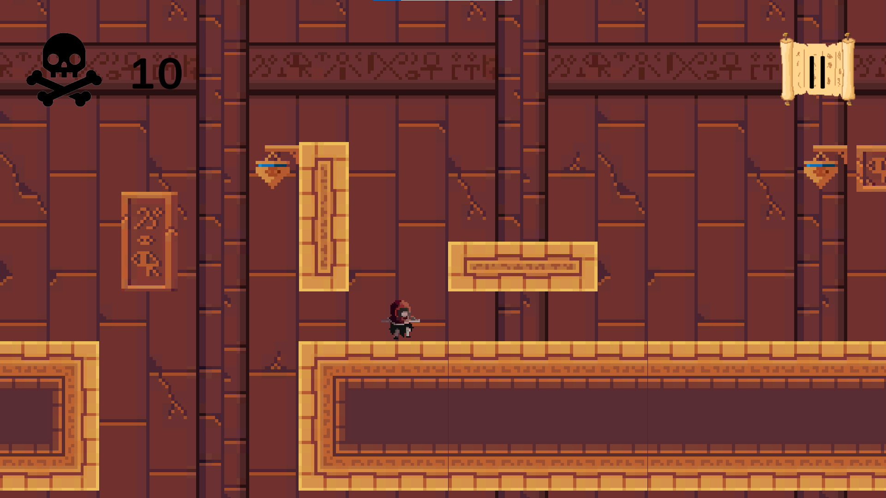

<!-- NeonRising -->

    <!-- One -->
    <section id= "one">
                 

                    <header class="major" data-position="center center">
                        <h2>Neon Rising</h2>
                    </header>
                 

    </section>      
    <section id="two" class="spotlights">
        <section>
            
            

                

                    
Neon Rising was my first project as a game developer. It is a vertical platform game where you have to use your bow to kill enemies and to teleport where the arrow hits on your way to climb way up high until reaching the one that killed your father in your childhood. It has to be said that almost every asset in the game was made by ourselves. 

                

            

        </section>
        <section>
            
            

                

                    <header class="major">
                        <h3>My Apportation</h3>
                    </header>
                    
In this project I was the one that had the first ideas of what we could do so then I worked in the design of both mechanics and dynamics of the game. I programmed the enemies behaviour, most of the GameManager and I was in charge of doing the test plan (it was mandatory) which turned out to be our tutorial

                

            

        </section>
         <section>
            
            

                

                    <header class="major">
                        <h3>Conclusions</h3>
                    </header>
                    
Afterall, It was really nice because as I said, this was where I started. We had to get used to working with VCSs (Version Control Systems) in this case GitHub and I learned a lot on how to work right in groups of people as we had to divide our work in milestones and sprints while we used Trello to have track of our issues.  

                

            

        </section>
        <section>
            <ul class="actions">
                <li><a href="https://sjulvez.wixsite.com/-neonrising" class="button">Project Website</a></li>
            </ul> 
            <ul class="actions">
                <li><a href="https://github.com/Proyectos1-FDI-UCM/c2022-Grupo06" class="button">Project Repository</a></li>
            </ul> 
        </section>
    </section>

    <!-- Two -->
    <section id="two">
        

            

            <header class="major" data-position="center center">
                <h3>Trailer</h3>
            </header>
            

            

                <video width="640" height="360" controls>
                    <source src="forty-jekyll-theme/assets/images/TrailerNeonRising.mp4" type="video/mp4">
                </video>
            

        

    </section>

<!-- Amon-Ra -->

    <!-- One -->
    <section id= "one">
                 

                    <header class="major" data-position="center center">
                        <h2>Amon-Ra</h2>
                    </header>
                 

    </section>      
    <section id="two" class="spotlights">
        <section>
            
            

                

                    
Amon-Ra is a project we did for the ComJamOn, a GameJam that took place in our university in 2023. To develop this project we barely had 3 days so we had to focus and work under pressure if we wanted to have the best product we could. In this GameJam we had been demanded to settle as main theme the words "Wrong Answer". So we did a Mario-like game that was full of traps. These traps's function was to make the player as angry as possible (we wanted to see people furious :) 

                

            

        </section>
        <section>
            
            

                

                    <header class="major">
                        <h3>Conclusions</h3>
                    </header>
                    
As it was a project involved in a lot of caos, I did work in almost every field (maybe excepting the sounds gestion) but what I enjoyed the most was designing the game levels because to do it we had to be in in the head of the players, think as them.

                

            

        </section>
         <section>
            
            

                

                    <header class="major">
                        <h3>My Apportation</h3>
                    </header>
                    
It was a really nice experience because all that stress and pressure made me feel as it was a great step on my way of becoming a game developer because I knew that I was going to learn a lot with that experience and I'm looking forward to do more look alike events.

                

            

        </section>
        <section>
            <ul class="actions">
                <li><a href="https://yiwangqiu.itch.io/amon-ra" class="button">Itchio page</a></li>
            </ul> 
        </section>
    </section>

