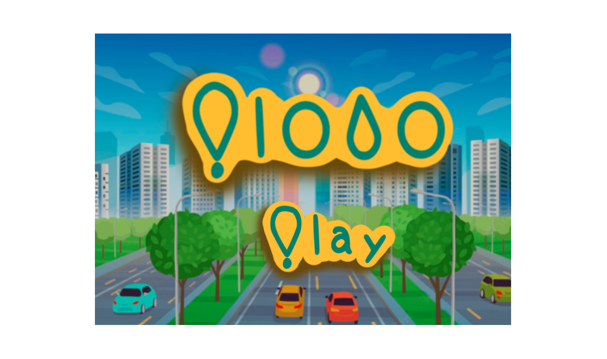

<!-- Main -->

<!-- One -->
<section id="one">
	

		<header class="major">
			<h2>Summary</h2>
		</header>
		
In this section you will find some projects other projects as blender animations or games made in other engines.

	

</section>

<!-- Two -->
<section id="two" class="spotlights">
	<section>
		<video width="640" height="360" controls>
			<source src="forty-jekyll-theme/assets/images/Cuando la locura llega.mp4" type="video/mp4">
		</video>
		

			

				<header class="major">
					<h3>Cuando la locura llega</h3>
				</header>
				
"Cuando la locura llega" is a blender animation I did as a final job for my animation subject and it was inspired by Far Cry 3 villain Vaas Montenegro. Here I tried to recreate his characteristics as a psychopath and exagerate them as we hadn't had time to use other kind of models that could allow us to have face animations. 

			

		

	</section>
	<section>
		  
		

			

				<header class="major">
					<h3>Plobo</h3>
				</header>
				
Plobo was a game made in Phaser and served as my introduction to JavaScript. In Plobo, we attempted to narrate a challenging story, partially based on a story from one of the developers' friends, in a satirical manner.

			

		

	</section>
	

	
	<section>
			<ul class="actions">
				<li><a href="https://github.com/sheilajulvez/PVLI-22-23-G12" class="button">Project Repository</a></li>
			</ul>
	</section>
	

	
</section>

