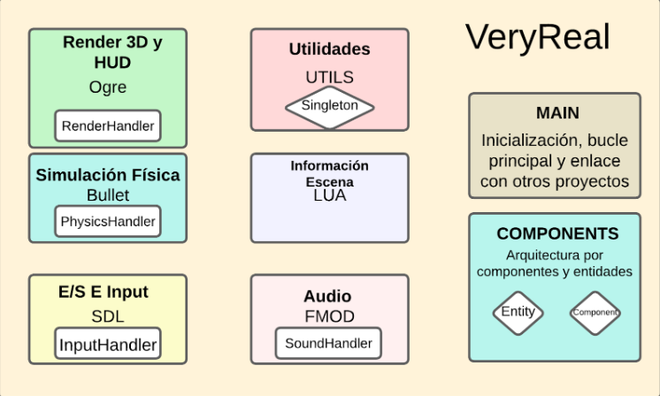
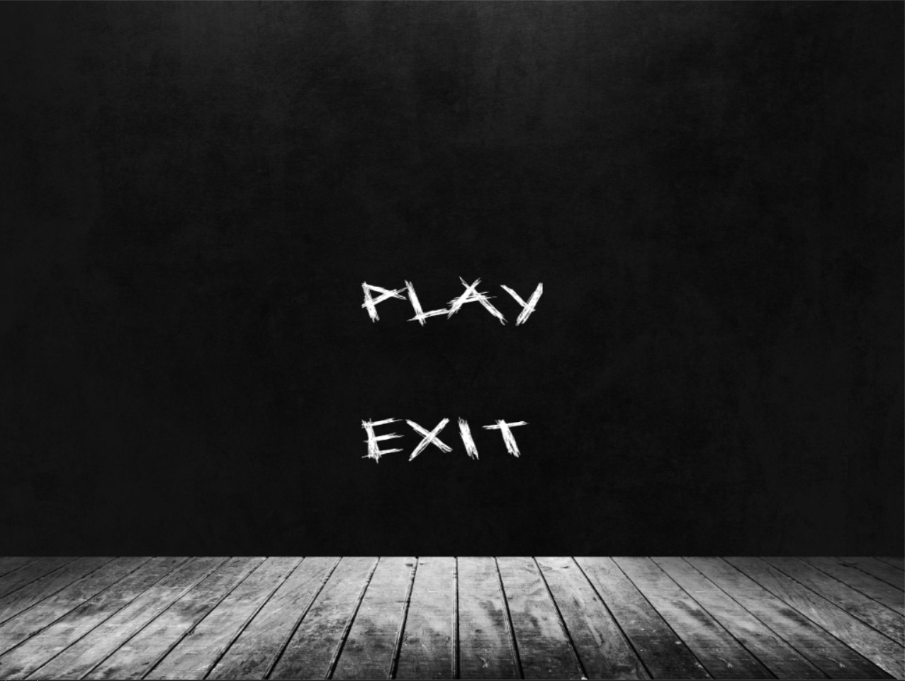
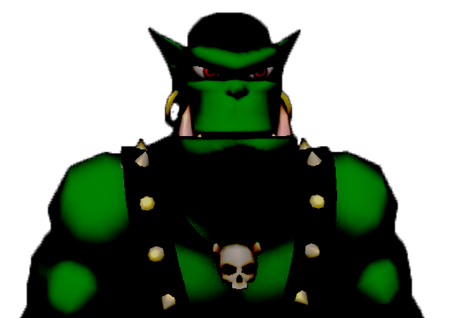
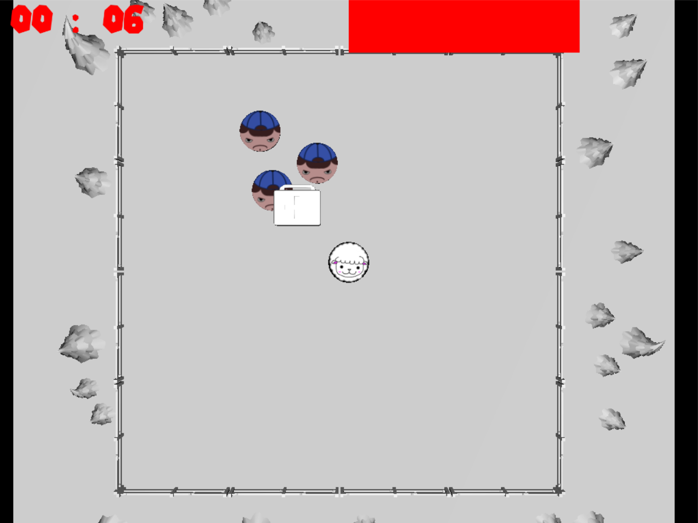

<!-- Main -->

<!-- One -->
<section id="one">
	

		<header class="major">
			<h2>Introduction</h2>
		</header>
		
Very Real is an videogame engine made by ourselves. To do it, we use known libraries as Ogre, SDL, FMOD or Bullet to implement our own engine.With the engine we developed two games run by it so we could test our own engine, Ogreman and OvejaVegana, later on will talk about it. Here you will find the project repository to see how our engine turned out. To play you have to download the game, once it is downloaded use VS prompt and execute the All.bat. After it the .exe will apear in the bin folder

	

	

<ul class="actions">
    <li><a href="https://github.com/UCM-FDI-DISIA/VeryReal" class="button">Project Repository</a></li>
</ul>
	

</section>

<section id="two" class="spotlights">
	<section>
		
		

			

				<header class="major">
					<h3>Starting Idea</h3>
				</header>
				
The idea was to create a videogame engine that had to be independent of the games that it runs. The game itself is a DLL. Once the engine builds itself up, starting the libraries and creating the singletons, the DLL is dinamicly charged so the programmer that uses our engine doesn't have to worry about doing it. With this idea in mind we had to be very careful to develop the engine so there is no dependencies between game and engine.

			

		

	</section>
	<section>
		
		

			

				<header class="major">
					<h3>How we dealt with </h3>
				</header>
				
The group was composed of 11 people so in order to work effectively we did pair programming. Each pair would take care of one of each of the six modules. In my case I was in charge of the input module, but the amount of work wasn't as big as we thought so when I finished I started helping other pairs, specially the ones in charge of the physics module. Later on, I would start learning how we could link the games proyects with the games with the idea of independency in mind and how could we pack our engine in a DLL in order to let our games use its functions.

			

		

	</section>
	<section>
		
		

			

				<header class="major">
					<h3>Ogreman</h3>
				</header>
				
Ogreman is a game inspired by Slenderman where you have to pick a number of notes in order to know what happened in the place you are at and to scape from the monster that lives within.
				In order to make it more tenebrous we wanted it to have a clear lack of light and we gave the player a torch that needed batteries to work so in order to explore the place you have to be careful of the batteries you pick and how they are used. The villain, Ogreman is programmed to have a patroll-like behaviour until it sees you or in case you run it hears you, in that case he will change his behaviour to seek and using an A* algorithm it will go to the room you are to catch you.

			

			<ul class="actions">
   				 <li><a href="https://github.com/UCM-FDI-DISIA/Ogreman" class="button">Project Repository</a></li>
			</ul>
		

	</section>
	<section>
		
		

			

				<header class="major">
					<h3>Oveja Vegana</h3>
				</header>
				
In this case we wanted to make a simpler game that could be played by anyone so inspired by Brotato we made a game where you are a sheep and you have to survive waves of hunters by shooting them. In case you are wounded you can heal with the medkit

			

			<ul class="actions">
   				 <li><a href="https://github.com/UCM-FDI-DISIA/OvejaVegana" class="button">Project Repository</a></li>
			</ul>
		

	</section>
</section> 

